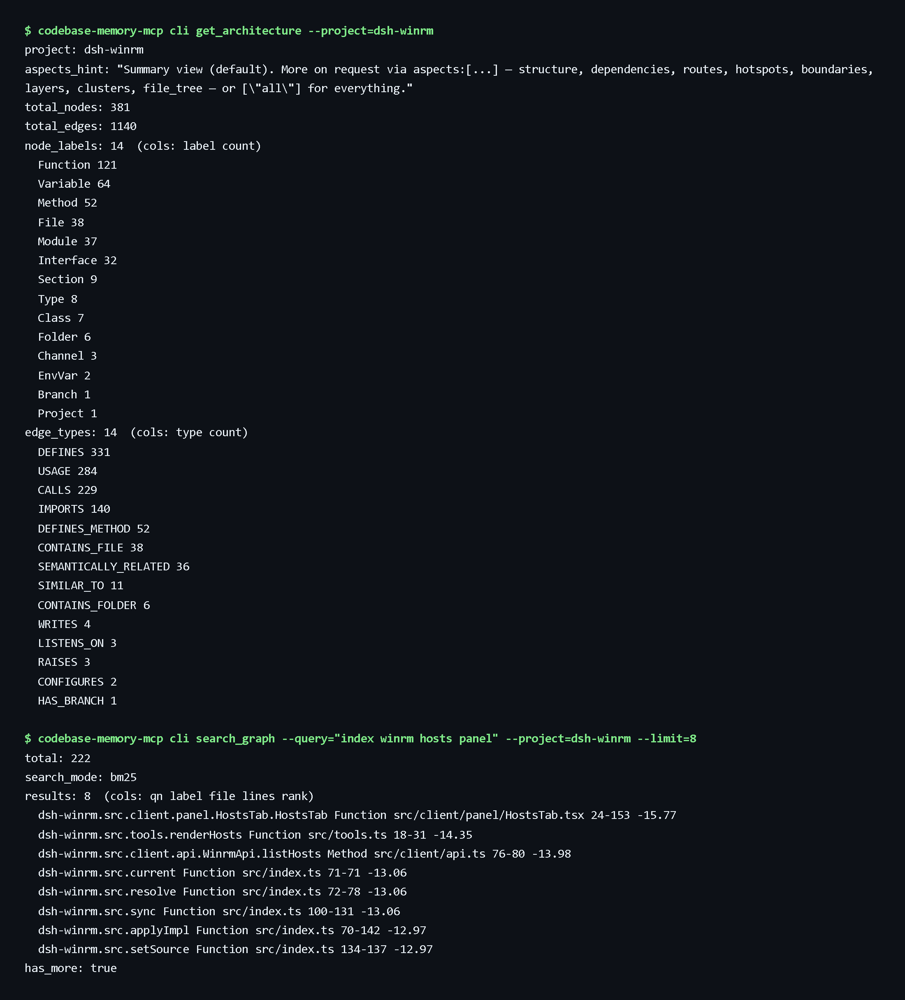

# DSH Codebase Memory（代码库记忆）

本地 DSH bundle，通过官方 `@deepseek-ai/dsh-mcp-client` 桥接 [Codebase Memory MCP](https://github.com/DeusData/codebase-memory-mcp)，并内置一个文件系统 watcher，让知识图谱随代码变更保持最新。

## 运行时

- `codebase-memory-mcp@0.10.8`
- Windows AMD64 发布件 SHA-256：`b43ad982994c4d829670749e08d3b622a74bb20041fc0a7d02bef6113f81c34d`
- MCP 命名空间：`mcp__codebase_memory__*`
- 图谱 UI：http://127.0.0.1:9749

## Bundle 注册

本包在 `cordis.patch.yml` 中注册两个 Cordis bundle：

| Bundle id | 用途 |
|---|---|
| `mcp-codebase-memory` | 把上游 MCP 服务器桥接进 DSH，原生暴露全部 `mcp__codebase_memory__*` 工具（search_graph、detect_changes、get_architecture、index_repository 等）。 |
| `dsh-codebase-memory-watcher` | 同一包内的第二个 bundle：为每个项目启动 chokidar watcher，防抖文件变更后通过全局 `codebase-memory-mcp` CLI 重新执行 `index_repository`。 |

watcher 不持有 MCP 客户端连接——每次重建都通过 `codebase-memory-mcp cli index_repository '{"repo_path":"..."}'` 子进程完成，上游索引器在小项目上足够快（`dsh-github` 30 秒内），可以接受。

## Watcher 路由（webServer 可用时自动注册）

| 方法 + 路径 | 请求体 / 查询参数 | 效果 |
|---|---|---|
| `GET /api/dsh-codebase-memory/watcher/list` | – | 列出全部持久化 watcher，含 `status`、`lastRun`、`lastDurationMs`、`lastError` 等 |
| `GET /api/dsh-codebase-memory/watcher/status?id=<id>` | – | 返回单个 watcher 的相同载荷 |
| `POST /api/dsh-codebase-memory/watcher/start` | `{ repoPath, debounceMs?, mode?, ignored?, watchedExtensions? }` | 启动 watcher（持久化状态，返回新 `id`） |
| `POST /api/dsh-codebase-memory/watcher/stop` | `{ id }` 或 `?id=` | 停止并标记 stopped（保留状态） |
| `POST /api/dsh-codebase-memory/watcher/rebuild` | `{ id }` | 忽略待处理变更，立即触发一次重建 |
| `POST /api/dsh-codebase-memory/watcher/restart` | – | 按持久化状态重启所有非 stopped watcher |
| `POST /api/dsh-codebase-memory/watcher/auto-attach` | – | 调 MCP 服务器的 `list_projects`，为尚未覆盖的每个项目启动 watcher |
| `GET /api/dsh-codebase-memory/watcher/cli-info` | – | 报告解析到的 `codebase-memory-mcp.exe` 路径 |

### 默认值（可在 `cordis.patch.yml` 配置）

- `debounceMs`：`5000`（5 秒静默期后重建）
- `mode`：`moderate`（类型感知 LSP 调用/使用解析；`fast` 跳过相似度，`full` 启用相似度并索引全部文件）
- `autoAttach`：`true`（启动时为 MCP 服务器已知的每个项目自动开 watcher）
- `usePolling`：`false`（默认原生文件通知；仅当文件系统丢事件时再开轮询，因为它会增加 CPU 与磁盘开销）
- `ignored`：`**/node_modules/**`、`**/.git/**`、`**/dist/**`、`**/build/**`、`**/.next/**`、`**/.turbo/**`、`**/.codebase-memory/**`、`**/.pnpm-store/**`、`**/target/**`、`**/__pycache__/**`、`**/.venv/**`
- `watchedExtensions`：`.ts`、`.tsx`、`.js`、`.jsx`、`.mjs`、`.cjs`、`.py`、`.go`、`.rs`、`.java`、`.cs`、`.rb`、`.php`、`.vue`、`.svelte`

### 状态持久化

watcher 记录保存在 `~/.dsh/dsh-codebase-memory/watcher.json`，在支持的平台上以仅所有者可读的权限写入。插件卸载时只关闭运行中的句柄、不改持久化意图；下次 DSH Web 启动会重建所有未被用户显式停止的 watcher。

## 截图




## 安装

从 [Releases](https://github.com/andyfan1094/dsh-codebase-memory/releases) 下载最新的 `dsh-codebase-memory-*.tgz` 并加入 profile：

```powershell
dsh plugin --profile web add D:\downloads\dsh-codebase-memory-0.2.0.tgz
```

本地开发可改用 checkout 链接安装：

```powershell
dsh plugin --profile web add link:D:/项目/dsh-codebase-memory
```

安装后重启 DSH Web 宿主。

## 卸载

```powershell
dsh plugin --profile web remove dsh-codebase-memory
```

全局运行时独立固定版本，可单独卸载：`npm uninstall -g codebase-memory-mcp`。
